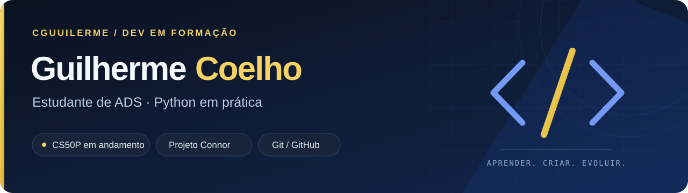

<!-- Perfil de Guilherme Coelho: apresentação objetiva, sem widgets externos. -->

  

  <a href="https://www.linkedin.com/in/guilherme-coelho-2449243b7/"><strong>LinkedIn</strong></a>
  &nbsp; · &nbsp;
  <a href="https://github.com/CGuuilerme/ProjConnor"><strong>Projeto Connor</strong></a>
  &nbsp; · &nbsp;
  <a href="https://www.instagram.com/proj_connor/"><strong>Diário do projeto</strong></a>

# Olá, eu sou Guilherme Coelho

Sou estudante de **Análise e Desenvolvimento de Sistemas (ADS)** e estou construindo minha base em programação com **Python**, lógica e Git/GitHub. Busco uma oportunidade de **estágio em TI** para aprender com uma equipe, contribuir com responsabilidade e transformar estudo em prática.

## Sobre mim

- Estudo ADS na **Estácio**, com conclusão prevista para setembro de 2028.
- Faço o **CS50P (HarvardX / edX)**, em andamento.
- Uso projetos pessoais para praticar fundamentos e registrar minha evolução.
- Estou fortalecendo programação, matemática e inglês com foco de longo prazo em inteligência artificial e machine learning.

## Projeto em destaque

### [Projeto Connor — gestão financeira em Python](https://github.com/CGuuilerme/ProjConnor)

Aplicação de terminal criada para praticar lógica de programação e evoluir, passo a passo, uma solução de controle financeiro.

- Menu interativo para adicionar saldo, registrar despesas e consultar o saldo.
- Validação de saldo disponível antes de registrar uma despesa.
- Consulta de histórico provisório das operações realizadas durante a execução.
- Próximas etapas: melhorar a estrutura do código, organizar transações, adicionar categorias, criar persistência de dados e explorar recursos de IA.

## Tecnologias e fundamentos em prática

| Área | Prática atual |
| :--- | :--- |
| **Python** | Entrada e saída de dados, tipos, funções, decisões, repetição e aplicações de terminal. |
| **Git e GitHub** | Commits, organização de repositórios, documentação e acompanhamento da evolução dos projetos. |
| **Fundamentos** | Lógica de programação, resolução de problemas e desenvolvimento incremental. |

## Estudos

- **CS50P:** introdução à programação com Python — em andamento.
- **Fundação Bradesco:** Python Básico — concluído, 18 horas.
- **Curso em Vídeo:** Lógica de Programação — concluído, 40 horas.
- **Prática complementar:** avaliação de respostas de IA, aderência a instruções e verificação de informações.

## Objetivo profissional

Quero iniciar minha carreira em tecnologia em um ambiente no qual eu possa aprender, receber feedback e contribuir com disciplina, curiosidade e evolução contínua.

Se quiser acompanhar essa jornada, visite o [Projeto Connor](https://github.com/CGuuilerme/ProjConnor) ou conecte-se comigo pelo [LinkedIn](https://www.linkedin.com/in/guilherme-coelho-2449243b7/).

---

**Aprender, criar e evoluir.**
